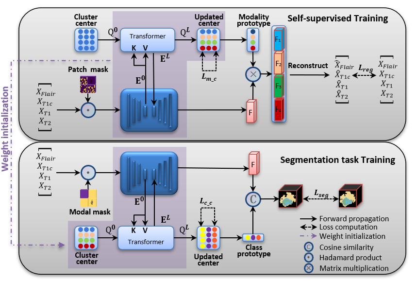

# _MCPL
## Multimodal Contrastive Prototype Learning for Resilient Brain Tumor Segmentation with Missing Modalities,J-BHI.

>Multimodal fusion is an effective solution for holistic brain tumor diagnosis, however, it faces challenge under missing modalities.
The existing single-encoder and multi-encoder approaches fail to capture modality-specific features and modality-shared features, thereby hindering the recovery of missing modalities. 
In this paper, we propose a two-stage dual-view prototype learning framework to extract the modality-specific feature and class-specific feature simultaneously. 
In the first stage, we utilize the transformer decoder to learning the modality-prototypes which are used to optimize the modality reconstruction task. 
A masked autoencoder is introduced to generate share-features of incomplete modalities. 
The learned modality-prototypes which contain modal-specific features are blended with the modality-share features for the reconstruction process. 
In the second stage, we learn the class-prototypes through the transformer decoder to generate segmentation mask through voxel-to-prototype comparation.
A masked modality strategy is introduced to handle random modality absence during training. 
Furthermore, modality-view and class-view contrastive learning strategies are developed to enhance the prototype learning. 
Comprehensive experiments on the BraTS2018 and BraTS2020 datasets demonstrate that the proposed method achieves competitive performance with missing modality.

### Approach
>

### Requirements:
> python 3.8
> 
> pytorch >= 0.4.1
> 
> transformers 4.8.1
> 
> timm 0.4.9

### Download:

* Pre-trained checkpoint [[14M](https://storage.googleapis.com/sfr-pcl-data-research/ALBEF/ALBEF.pth)] / [[4M](https://storage.googleapis.com/sfr-pcl-data-research/ALBEF/ALBEF_4M.pth)]
* <a href="https://storage.googleapis.com/sfr-pcl-data-research/ALBEF/data.tar.gz"> Dataset json files for downstream tasks</a>

### Dataset: 
> * <a href="https://www.kaggle.com/datasets/sanglequang/brats2018"> Brats 2018</a>
>
> * <a href="https://www.kaggle.com/datasets/awsaf49/brats2020-training-data?resource=download"> Brats 2020</a>

### Training and Test:
>Pretrained:  `python pretrain.py`
> 
>Finetune: `python finetune.py`
> 
> Test: `python test.py` via test.sh

### Visualization:
>Pretrain Visualization
>
>

>Segmentation Visualization
>
>

### Citation
If you find this code to be useful for your research, please consider citing.
<pre>
</pre>

### Acknowledgement
>
> 
### TO DO
    This is an initial version, we will re-organize it after the final publication. 

