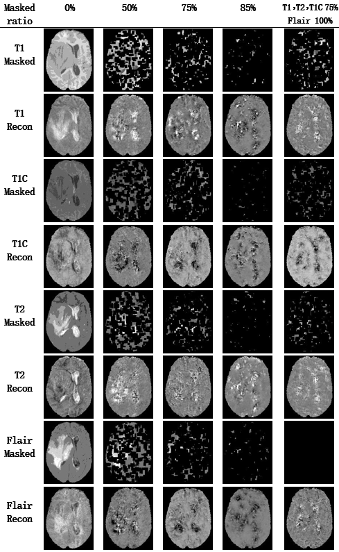

# MCPL
## Multimodal Contrastive Prototype Learning for Resilient Brain Tumor Segmentation with Missing Modalities,J-BHI.

>Multimodal fusion is an effective solution for holistic brain tumor diagnosis, however, it faces challenge under missing modalities.
The existing single-encoder and multi-encoder approaches fail to capture modality-specific features and modality-shared features, thereby hindering the recovery of missing modalities. 
In this paper, we propose a two-stage dual-view prototype learning framework to extract the modality-specific feature and class-specific feature simultaneously. 
In the first stage, we utilize the transformer decoder to learning the modality-prototypes which are used to optimize the modality reconstruction task. 
A masked autoencoder is introduced to generate share-features of incomplete modalities. 
The learned modality-prototypes which contain modal-specific features are blended with the modality-share features for the reconstruction process. 
In the second stage, we learn the class-prototypes through the transformer decoder to generate segmentation mask through voxel-to-prototype comparation.
A masked modality strategy is introduced to handle random modality absence during training. 
Furthermore, modality-view and class-view contrastive learning strategies are developed to enhance the prototype learning. 
Comprehensive experiments on the BraTS2018 and BraTS2020 datasets demonstrate that the proposed method achieves competitive performance with missing modality.

### Approach
>

### Requirements:
> python 3.8
> 
> pytorch >= 0.4.1
> 
> transformers 4.8.1
> 
> timm 0.4.9

### Model Download:
> <a href="https://pan.baidu.com/s/1PZTVbzIoXzloEXTTJlo4Ng"> model</a>
     code: 2133
### Dataset: 
> * <a href="https://www.kaggle.com/datasets/sanglequang/brats2018"> Brats 2018</a>
>
> * <a href="https://www.kaggle.com/datasets/awsaf49/brats2020-training-data?resource=download"> Brats 2020</a>

### Training and Test:
>Pretrained:  `python pretrain.py`
> 
>Finetune: `python finetune.py`
> 
> Test: `python test.py` via test.sh

### Visualization:
>Pretrain Visualization
>
>

>Segmentation Visualization
>
>

HD			HD95			DICE_std			DICE_mean		
ET	TC	WT	ET	TC	WT	ET	TC	WT	ET	TC	WT
8.894521274	10.08393806	20.27544681	2.05505522	3.536522722	4.447688141	0.15122843	0.10131558	0.059922848	0.85874784	0.8912088	0.91382104
9.139169209	10.4537349	20.82574328	2.052331086	3.700782771	5.413501385	0.17587349	0.12842342	0.077759124	0.84878707	0.8821849	0.8825997
8.750576535	9.994739235	19.89550973	2.099505175	3.372366331	4.308794833	0.14984159	0.09827473	0.060287233	0.8573567	0.890418	0.91351265
11.60307039	12.96211385	21.21677421	4.925572335	6.035254877	4.558891979	0.24633078	0.16292742	0.061845746	0.63018066	0.79552656	0.9088121
8.811061921	10.00310553	21.84100754	2.12366059	3.353189142	5.3797746	0.15450814	0.09906637	0.06393819	0.85490036	0.890324	0.9073374
8.913873049	9.921012734	20.57991744	2.203505966	3.47525658	5.042822143	0.15445107	0.09859558	0.05994265	0.8526851	0.88827044	0.90909135
11.36105403	13.04878074	21.8574242	4.874372137	6.256311582	4.580992434	0.25031647	0.15751772	0.06305459	0.6142586	0.7921197	0.9064664
11.47549268	12.91309674	21.30825101	5.129800915	6.320693869	5.943552211	0.2631429	0.15968286	0.07051596	0.5982667	0.783125	0.8820191
11.96882935	13.84927268	21.68113348	5.708557401	6.555191812	5.290499621	0.28317866	0.16649798	0.06747027	0.56862605	0.7845114	0.9012399
9.057101072	10.35319301	23.30333077	1.98184399	3.642334824	8.360789402	0.19456376	0.13783915	0.11180041	0.8376238	0.8726231	0.82266855
9.140421888	10.50237731	21.87237922	2.143696127	3.842986798	5.813428348	0.17563216	0.13533054	0.07870312	0.8468647	0.87812513	0.87998146
13.7901083	16.28095009	22.83733223	6.871573572	8.775338275	6.435108097	0.28484347	0.17585397	0.077128336	0.5062839	0.7343679	0.8874321
16.43707783	17.6876994	26.10734912	8.887018472	9.934067098	10.73072663	0.28592613	0.21169436	0.12802064	0.5058367	0.7265081	0.79865515
9.255367437	10.86644113	25.39627757	2.148768778	3.897003703	9.231524062	0.2051086	0.13274999	0.12251439	0.8304967	0.87319094	0.80840325
11.32472224	13.09135476	23.90820769	5.116611948	6.549443342	6.213238169	0.2736991	0.1630337	0.07939173	0.58473593	0.7759226	0.8683624

### Citation
If you find this code to be useful for your research, please consider citing.
<pre>
</pre>

### Acknowledgement
>
> 
### TO DO
    This is an initial version, we will re-organize it after the final publication. 

